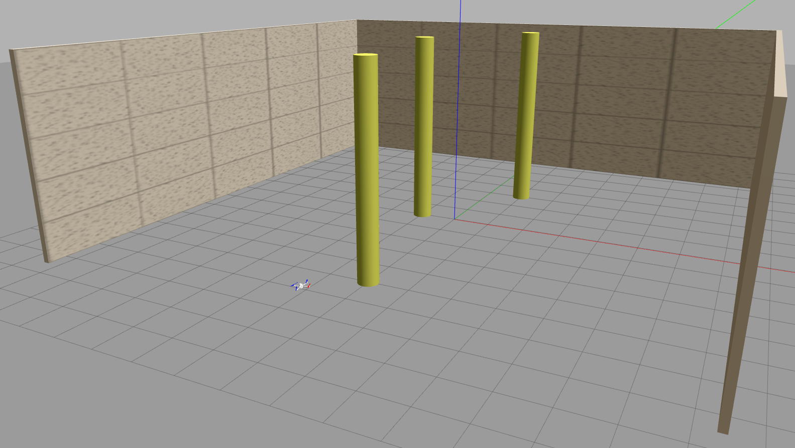

# FSR Technical project
This is the technical project for the Field and Service Robotics exam, at
University Federico II of Naples.

## Introduction
The aim of this project is to develop a system able to perform motion planning
and control for a **VTOL UAV**. In particular, an *AscTec Hummingbird*
quadcopter has been considered; however, the system can work with any
other UAV.

Motion planning is performed via **artificial potential** method, with a
**navigation function**-based algorithm to avoid local minima.
The control is achieved through a **passivity-based hierarchical controller**.

## Play the scene
In order to play the provided scene, use the main launch file:

    roslaunch quad_control main.launch

## Create your own scene
You can use any Gazebo scene in this project: you can modify the room size and
add new objects. To include your own scene, a corresponding 3D octomap and 2D
occupancy grid must be generated, and the world_name parameter in the launch
file needs to be set accordingly.

First, create the scene you want in Gazebo. To generate a 3D octomap, use:

    roslaunch quad_control buildOcto.launch world_name:=<your_world_name>

Then, to generate a 2D occupancy grid, use:

    roslaunch quad_control buildMap.launch world_name:=<your_world_name>

Finally, call the script fixMap.py inside the *script* directory as:

    python fixMap.py <your_world_name>

You're now ready to use your own scene in the project. Just set the world_name
arg in the main.launch file.

## Dependencies
Dependencies goes here...

## Documentation
In the doc folder you can find [a detailed report](quad_control/doc/Report.pdf)
on the project and [a video demonstration](quad_control/doc/video.mp4).
